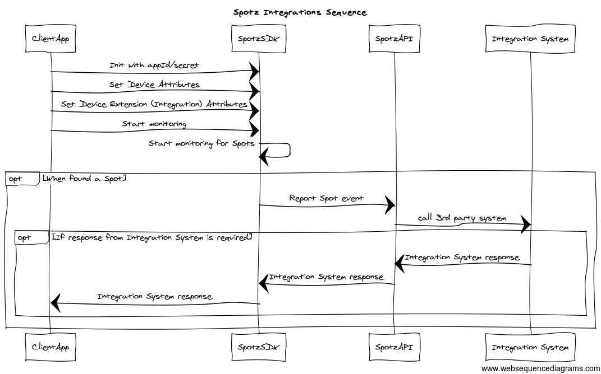

Spotz Integration Guide
=======================

### Introduction

Localz Spotz platform allows developers to effortlessly integrate microlocation services into their mobile applications. 
This involves 3 steps:
 
 - Setting up locations you are interested in on the Spotz console
 - Initializing Spotz in your mobile application
 - Acting on Spotz notifications when you reach one of the locations

In the third step, developers often need to contact 3rd party APIs to obtain location specific information (e.g. get a promotional code relevant to the supermarket location) or to report the fact of user coming to the location for auditing purposes. Spotz platform includes its own integration framework. Using this framework, these calls can be made without writing a single line of code. In fact, any number of 3rd party APIs could be called on demand, after the application is in production. 
Interested? Keep reading.

### Spotz integration - high level view

As shown on the sequence diagram below, the Spotz platform will call a 3rd party system when a spot is discovered, and if required, provide results back to your application.

The developer chooses the integrations on Spotz Web Console. As soon as integration is assigned to a spot, it will be called any time a device reaches this spot. Hence you can turn on and off any of third party calls any time!

### Spotz integration - supported 3rd party systems

Integration with the following 3rd party systems is supported:

- <b>Teradata ARTIM (Aprimo Real Time Interaction manager) </b>is part of Teradata <a href=\"http://marketing.teradata.com\"> Marketing Solution suite. </a> Using teradata ARTIM your application can receive personalised offers and promotions.
- <b>Teradata DMC (Digital Marketing Centre)</b> which is part of the Teradata application suite allows you to add additional data to customer profiles within the DMC console.
- <b><a href=\"https://segment.com\">Segment</a></b> is a cloud platform for collecting, translating and routing customer data. Segment is integrated with a large number of systems, where this data can be analysed and visualied. 
- <b><a href=\"http://zapier.com\">Zapier</a></b> enables you to automate tasks between other online services. There are two basic principles to Zapier: a trigger, then an action. You can use an event of entering a spot as a trigger event in Zapier (webhook).
- <b>Screenz-API</b> is a Localz-developed extension for managing location-aware interactive screens. Intended to provide customers with a personalised experience through screens which respond to the customer’s proximity to the screen.
- <b>HTTP GET WEBHOOK</b> use this extension to retrieve (HTTP GET) json data from a URL of your choice when user enters a spot.
- <b>Urban Airship</b> push notification and CRM service to add customer details within their service.

These systems are a part of the second Spotz release, and we are activily working on adding more 3rd party integrations to Spotz platform. If you have any suggestions on what systems Spotz should integrate with, [drop 
us a line] (mailto:spotz@localz.com).
 
### Spotz integration - Tutorial

In this tutorial we will extend the Spotz demo app [(Android)](https://github.com/localz/Spotz3-Android-SDK) and [(iOS)](https://github.com/localz/Spotz3-iOS-SDK) by adding a call to a 3rd party server. 

#### Create Applicatiion - Setup Integration 

 - First login to [Spotz Web Console](https://console.localz.io) and create an application. Record the <b>Application ID</b> and <b>Client Key</b> for the mobile platform of your choice. You will need them when writing client side code. This can be viewed in your application settings after typing in your password.
 
 - Choose <b> Extensions </b> Left menu item. Click <b> + Create new Extension</b> and choose <b> HTTP GET WEBHOOK </b>.

  
 
 - Populate <b>http://api.fixer.io</b> into both <b>Host Dev</b> and <b>Host Production</b> text fields and type <b>80</b> into <b>Port</b>.

  
 
 - Click Update.
  
 You have just added an integration to your application. You have only provided the URL and port of the integration however. At this stage nothing will be called, as you need to add this integration to one or many spots. 
 
#### Create Spotz - Setup Integration

- Choose <b> Spotz </b> from the left menu.
- Create a Spot if required
- Click <b> Edit </b> spot and then select <b> Integrations </b> tab
- Select <b>httpGetWebhook<b> as the integration type
- Populate <b>/latest?base=USD</b> into both <b> Path Dev</b> and <b> Path Production </b> text fields. Press <b> + Add Integration </b> button. And then <b> Update </b> button to save the spot.

 

You have just configured the Spotz platform to call the Webhook to get exchange rates for USD when device detects the spot. Easy? About the same amount effort required to configure any other extension. The only thing left is to handle the response in the mobile app. 

#### Write client code - pass identities, receive integration response

- Follow the instructions for [Android](https://github.com/localz/Spotz3-Android-SDK) or [iOS](https://github.com/localz/Spotz-iOS-SDK) to create a test Spotz application. 
- When you run the app and discover the spot, the web server http://api.fixer.io/latest?base=USD. Now you only need to handle the response from the webserver. The instructions are platform specific and corresponding Readme files have the details. 

As an exercise, try to register two spots and get AUD exchange rates for the second spot. 

As another exercise, add [Zapier Webhook](https://zapier.com/zapbook/webhook/) to your application and spot. 

 - Try to send an email to yourself whenever you detect the spot. Include some Spotz information, e.g. Spotz metadata
 - Try also to include the name of the person using the app - you will need to pass their identity when initialising Spotz. 

     