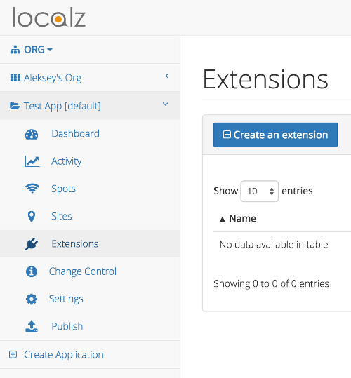
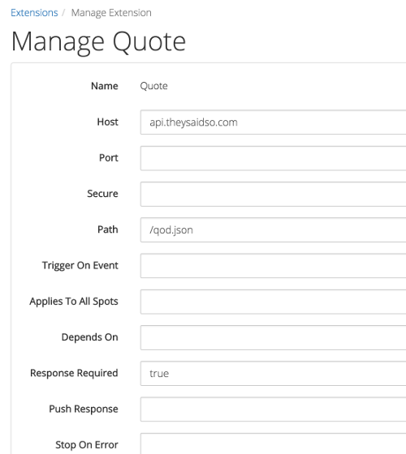
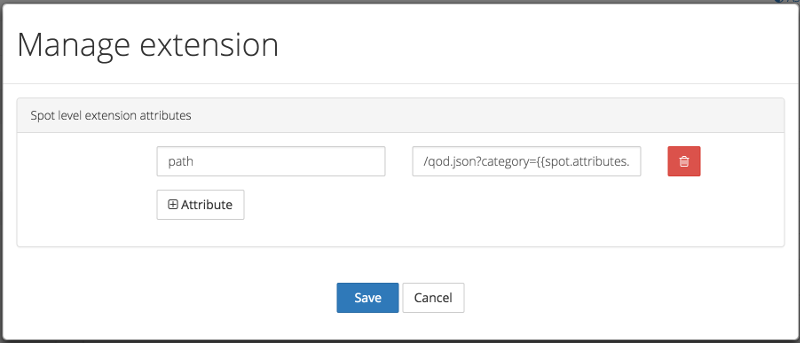

Spotz Extensions Guide
=======================

### Introduction

Localz Spotz platform allows developers to effortlessly integrate microlocation services into their mobile applications. 
This involves 3 steps:
 
 - Setting up locations you are interested in on the Spotz console
 - Initializing Spotz in your mobile application
 - Acting on Spotz notifications when you reach one of the locations

In the third step, developers often need to contact 3rd party APIs to obtain location specific information (e.g. get a promotional code relevant to the supermarket location) or to report the fact of user coming to the location for auditing purposes. Spotz platform includes its own extensions framework. Using this framework, these calls can be made without writing a single line of code. In fact, any number of 3rd party APIs could be called on demand, after the application is in production. 
Interested? Keep reading.

### Spotz Extensions - high level view

As shown on the sequence diagram below, the Spotz platform will call a 3rd party system when a spot is discovered, and if required, provide results back to your application.

The developer chooses an extension on Spotz Web Console. As soon as an extension is assigned to a spot, it will be called any time a device reaches this spot. Hence you can turn on and off any of third party calls any time!

### Spotz Extensions - supported 3rd party systems

Integration with the following 3rd party systems is supported:

- <b>Teradata RTIM (Real Time Interaction manager) </b>is part of Teradata [Marketing Solution suite](http://marketing.teradata.com). Using teradata RTIM your application can receive personalised offers and promotions.
- <b>Teradata DMC (Digital Marketing Centre)</b> which is part of the Teradata application suite allows you to add additional data to customer profiles within the DMC console.
- <b>[Segment](https://segment.com)</b> is a cloud platform for collecting, translating and routing customer data. Segment is integrated with a large number of systems, where this data can be analysed and visualied. 
- <b>[Zapier](http://zapier.com)</b> enables you to automate tasks between other online services. There are two basic principles to Zapier: a trigger, then an action. You can use an event of entering a spot as a trigger event in Zapier (webhook).
- <b>Screenz-API</b> is a Localz-developed extension for managing location-aware interactive screens. Intended to provide customers with a personalised experience through screens which respond to the customer’s proximity to the screen.
- <b>HTTP GET WEBHOOK</b> use this extension to retrieve (HTTP GET) json data from a URL of your choice when user enters a spot.
- <b>Urban Airship</b> push notification and CRM service to add customer details within their service.

These systems are a part of the second Spotz release, and we are activily working on adding more 3rd party Extensions to Spotz platform. If you have any suggestions on what systems Spotz should integrate with, [drop us a line](mailto:info@localz.com).
 
### Spotz Extensions - Tutorial

To start making API calls to 3rd party systems you'll need to setup an Extension for you Application and Spot (optional). You can have as many Extensions (of the same type) as you want, provided that the have unique names.

For each Extension type you will have to provide Extension specific attributes, e.g. <i>host</i>, <i>port</i>, <i>authorization</i>, etc. For most use cases, setting up an Extension at the Application level should be enough (keep on reading for details). However, if an Extension has mandatory Spot-level attributes or you would like to enable/setup an Extension only for certain Spots - you will have to enable/setup this Extension for each individual Spot.

Apart from Extension specific attributes, all Extensions have the following common attributes:
 
 - <b>triggerOnEvent</b> - if set to <i>enter</i> - Extension will only be executed when a user "enters" a Spot (default), if set to <i>exit</i> - Extension will only be executed when a user "exits" a Spot, if nothing is specified - Extension will be executed on both events

 - <b>appliesToAllSpots</b> - if set to <i>true</i> - Extension will be executed for all Spots in a Project, otherwise - only for Spots which are setup to use this Extension (this attribute can only be set for Extensions which do not require Spot-level attributes)

 - <b>dependsOn</b> - this attribute allows you to chain Extensions. Set it to a name of another Extension this Extension will be executed only after the dependent Extension is completed

 - <b>responseRequired</b> - set this to <i>true</i> only if you need to get the response from an Extension back to your client app (this may significantly slow down the response from the Spotz API server)

 - <b>stopOnError</b> - if you have multiple Extensions - set this attribute to <i>true</i> if you would like to abort executing Extensions after any of them fails

 - <b>timeout</b> - Extension request timeout in milliseconds (defaults to 10 seconds)

In this tutorial we will extend the Spotz demo app [(Android)](https://github.com/localz/Spotz3-Android-SDK) and [(iOS)](https://github.com/localz/Spotz3-iOS-SDK) by adding a call to a 3rd party system - 'They Said So' quotes API. 

#### Create Applicatiion - Setup an Extension

 - First login to [Spotz Web Console](https://console.localz.io) and create an Application. Record the <b>Application ID</b> and <b>Application Key</b> for the mobile platform of your choice. You will need them when writing client side code.
 
 - Choose <b> Extensions </b> left menu item. Click <b> Create an extension</b> and choose <b> HTTP GET Webhook </b>.

  
 

 - Set 'Quote' as a name fot this Extension.

 - Set <i>api.theysaidso.com</i> as a value for a <b>Host</b> attribute.

 - Set <i>/qod.json</i> as a value for a <b>Path</b> attribute (this will be the default <b>Path</b> for all Spots, but we can override it in each Spot).

 - Set <i>true</i> as a value for a <b>Response Required</b> attribute (this way Spotz SDK will return the Extension response to your Client App).
 
 - Leave other attributes to their defaults (<i>Port</i> will default to 80, <i>Secure</i> will default to 'false' (will use HTTP rather than HTTPS)).

  
 
 - Save your changes.
  
You have just added an Extension to your Application. At this stage nothing will be called, as you need to add this Extension to one or more Spots. 
 
#### Create Spot - Setup an Extension

You can enable your Extension for all Application Spots by setting Application level <i>Applies To All Spots</i> attribute to 'true'. For this exercise we will manually add this Extension to a Spot.

 - Choose <b> Spots </b> from the left menu.

 - Create a Spot if not already created.

 - Click <b> Edit </b> Spot and then select <b> Extensions </b> from the left menu.

 - Link the 'Quote' Extension we've created for the Application

 - Set <i>/qod.json?category={{spot.attributes.qod_category}}</i> as a value for a <b>path</b> attribute (this will be the <b>path</b> for this particular Spot). Save your changes.

Did you notice that <i>{{spot.attributes.qod_category}}</i> part in the <b>path</b> attribute? It tells the Spotz API to use a Spot attribute called 'qod_category' when making a request to a 3rd party system. So now you just need to update your Spot and add this attribute.

When a User hits this Spot - Spotz API will call your 'Quote' Extension using URL <i>http://api.theysaidso.com/qod.json?category=funny</i>

You have just configured the Spotz platform to call a web hook to get a 'quote of the day' from a 3rd party API. Easy? About the same amount effort is required to configure any other extension. The only thing left is to handle the response in the mobile app.

#### Using Spot data in Extensions

In the example above we used a Spot attribute to provide a value for a 'category'. In fact, any Extension attribute can be represented as a dynamic template using <i>{{value}}</i> Mocha-like syntax.

Spotz API makes Application, Site, Spot and Device data available to your Extension via a Context object which looks like this:
 
    var context = {
        extension: {
            name: 'Quote',            // Extension Name
            type: 'HTTP GET WEBHOOK', // Extension Type
            // Merged Application, Spot and Device Extension attributes
            attr1: '',
            attr2: ''
        },
        project: {        
            projectId: 'qwe123qwe',   // Application ID
            name: 'Name',             // Application Name
            env: 'Development',       // Application Environment
            extension: {              // Application level Extension attributes
                attr1: '',
                attr2: ''
            }
        },
        spot: {
            name: 'The Spot',         // Spot Name
            spotId: 'qwe123qwe',      // Spot Id
            tags: ['tag1', 'tag2'],   // Spot Tags
            attributes: {             // Spot Attributes
                attr1: '',
                attr2: ''
            },
            extension: {              // Spot level Extension attributes
                attr1: '',
                attr2: ''
            }
        },
        device: {
            deviceId: 'qwe123qwe',    // Device Id
            identity: 'qwe123qwe',    // Identity associated with a Device
            deviceType: 'Android',
            os: {
                type: 'android',
                ver: '5.0.0'
            },
            app: {
                appId: 'com.android.app',
                ver: 1,
                build: '1.0.0',
                sdk: '3.0.0'
            },
            locale: 'en_AU',
            lang: 'en',
            tz: 'Australia/Hobart',
            attributes: {             // Device Attributes
                attr1: '',
                attr2: ''
            },
            extension: {              // Device level Extension attributes
                attr1: '',
                attr2: ''
            }
        },
        event: {
            id: 'qwe123qwe',          // Unique Event Id
            type: 'enter',            // Event Type ('enter' or 'exit')
            dateTime: '2014-08-28T06:57:48Z',
            enter: true               // true - if Event Type is 'enter', otherwise - false
        },
        trigger: {
            id: 'qwe123qwe',          // Trigger Id
            type: 'beacon'            // Trigger Type ('beacon', 'geofence', 'nfc', 'qr')
        },
        extensions: {                 // Response from all executed Integrations
            integrationName: {        // Extension name
                type: 'teradataRTIM', // Extension type
                response: {           // Extension response (whatever is received from a 3rd party system)
                    statusCode: 200,  // Response status code
                    headers: {        // Response headers
                        ...
                    },
                    body: {           // Response body
                        ...
                    }
                }
            }
        }
    };

#### Write client code - set device identity and attributes, receive extension response

 - Follow the instructions for [(Android)](https://github.com/localz/Spotz3-Android-SDK) and [(iOS)](https://github.com/localz/Spotz3-iOS-SDK) to create a test Spotz application.

 - When you run the app and discover a Spot, Spotz API will 3rd party systems defined in your Extensions. Now you only need to handle the response. The instructions are platform specific and corresponding Readme files have the details.

As an exercise, add [Zapier Webhook](https://zapier.com/zapbook/webhook/) to your Application and Spot.

 - Try to send an email to yourself whenever you detect the Spot. Include some Spot information, e.g. Spot metadata

 - Try also to include the name of the person using the app - you will need to pass their identity when initialising Spotz (see platform specific guides).

     
