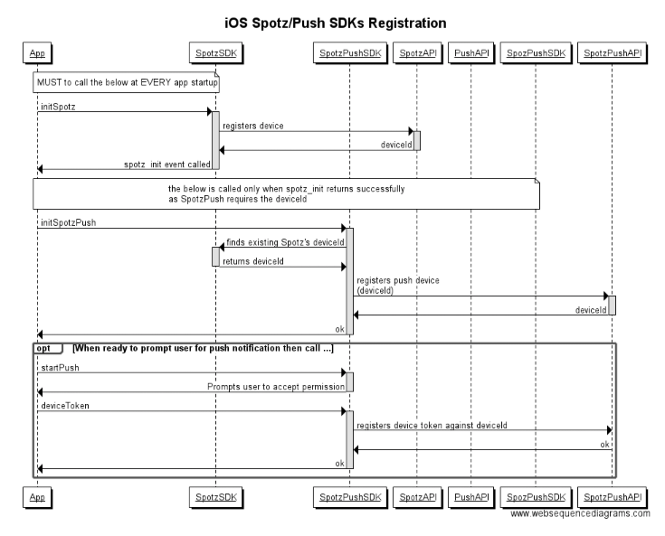

# iOS Spotz and SpotzPush SDKs Integration

In order to ensure SpotzSDK and SpotzPushSDK are registered correctly, see the following SDKs init sequence:

The above must be run at app startup as push's deviceToken from Apple may change at anytime.
